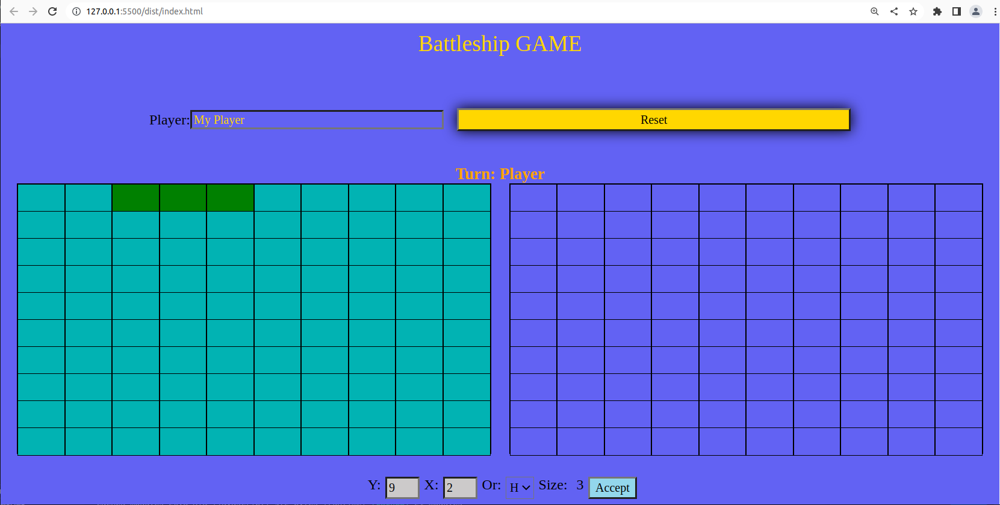

# Battleship
Battleship game for practicing TDD in the Odin Project.

STATUS(todo's):

* random placement of computer ships(currently fixed).
* better Winner message(currently window alert).
* flexible size of ships (currently 3 blocks fixed).
* flexible number of ships (currently only 3 ships).
